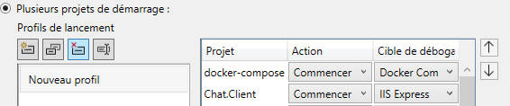
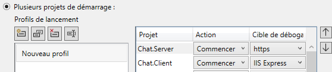

# Simple Chat Application - itw-challenge

A simple chat application built with ASP.NET Core Web API and Blazor WebAssembly.
Please refer to the [RULES.md](RULES.md) file for the challenge requirements.

## Features

- User login with simple username entry
- User list
- Real-time message exchange
- Message history stored in PostgreSQL database
- Modern UI with MudBlazor components
- Responsive design for various screen sizes

## Tech Stack

- .NET 9 with C# 13
- ASP.NET Core Web API with minimal APIs
- Blazor WebAssembly
- Entity Framework Core with PostgreSQL
- MudBlazor component library
- Docker and Docker Compose for containerization
- XUnit for testing

## Project Structure

### Application projetcts

- [`Chat.Server`](src\Server\Chat.Server.csproj): Backend API project with minimal APIs
- [`Chat.Client`](src\Client\Chat.Client.csproj): Blazor WebAssembly client application
- [`Chat.Shared`](src\Shared\Chat.Shared\Chat.Shared.csproj): Library of Shared models, DTOs, DbContext Abstraction
- [`Chat.Routes`](src\Shared\Chat.Routes\Chat.Routes.csproj): Library of REST Routes configuration and handling

### Utilities projetcs

- [`AdaptiveLogging`](src\utilities\AdaptiveLogger\AdaptiveLogging.csproj): A Logging provider for webassembly Blazor application
- [`XUnitLogging`](src\Utilities\XUnitLogging\XUnitLogging.csproj): A Logging provider for XUnit
- [`XUnitPostgreSQL`](src\Utilities\XUnitPostgreSQL\XUnitPostgreSQL.csproj): PostegreSQL Dockerization for unit testing with XUnit
- [`EFUtilities`](src\Utilities\EFUtilities\EFUtilities.csproj): A set of utility extensions method for Entity Framework Core

### Testing Project

- [`Chat.Server.Tests`](src\tests\Chat.Server.Tests\Chat.Server.Tests.csproj): Tests API and Database server

### Running Project

- [`Server Dockerfile`](src\Server\Dockerfile): Multi-stage Docker build file Server
- [`Client Dockerfile`](src\Client\Dockerfile): Multi-stage Docker build file Client
- [`docker-compose.yml`](src\docker-compose.yml): Docker Compose configuration for running Server

---
---

>### Database (EF)

- **Models**
  - [User model](src\Shared\models\User.cs) represent physical user
  - [Message model](src\Shared\models\Message.cs) represent message between users

- **Dto**
  - [SendMessageDto](src\Shared\dtos\SendMessageDto.cs) serve to send message across network from Browser to Server

- **Migration**

  - Database Migration using Entity Framework Core (EF Core) using an extension generic method [`MigrateDatabase<TDbContext>()`](src\EFUtilities\EFExtensions.cs#L19) in [`EFextensions.cs`](src\EFUtilities\EFExtensions.cs) where `TDbContext` must be a `DbContext` and [`IChatDbContext`](src\Shared\data\IChatDbContext.cs) which provides a base class for interacting with the database and for separation of concerns.  The `MigrateDatabase<TDbContext>()` method is used to apply pending migrations to the database.

- **Seeding**

  - Database seeding is implemented only in Debug and Development  mode. In Release mode or Production mode, the database seeding is disabled by default.
    Using an extension method [`SeedAsync.cs`](src\EFUtilities\EFExtensions.cs#L46) in the [`EFextensions.cs`](src\EFUtilities\EFExtensions.cs) class. This method ensures that the database is created before executing the seed action, which can be used to populate the database with initial data.

>### Routing (REST)

- Route handling by minimal api
- Routes configuration using an extension method [`ConfigureChatRoutes`](src\Chat.Routes\HostExtensions.cs#L59) in the [`HostExtensions.cs`](src\Chat.Routes\HostExtensions.cs) class. The extension method allows you to configure routes in a more concise way by using options delegates.

>### UI (Blazor WebAssembly + MudBlazor)

- **[MainLayout](src\Client\Shared\MainLayout.razor)**
  - Encapsulate other pages in a single layout file for better organization and maintainability.
  - Verify the health of the server. If it is offline an overlay will be displayed.
  - Manage the app menu bar (User name and logout)
- **[Login Page](src\Client\Pages\Login.razor)**
  - A Simple Login/registration. When user has type his name, it will saved in LocalStorage's Browser.
  - It will be recovered when thee browser page is refreshed or closed.
  - In case of another "session" for a different user in browser tab,  just logout and login again.
- **[Index Page](src\Client\Pages\Index.razor)**
  - When user logged in, it will automatically redirect to this page
  - User must select a "friend" from list of users to chat with.
  - Type a message and send it
  - Refreshing received messages is automatic or manual
  - Refreshing of Friends list is automatic or manual

- Components
  - **[ChatChatPanel](src\Client\Components\ChatChatPanel.razor)** : Where messages are displayed
  - **[ChatUserPanel](src\Client\Components\ChatUserPanel.razor)** : Where list of registered user are displayed
  - **[LoginForm](src\Client\Components\LoginForm.razor)** : Login component that permit to register and access the chat room
  - **[SendMessage](src\Client\Components\SendMessage.razor)** : Component that permit to send messages and refreshing

>### Testing Server API (XUnit)

## Running Application and Debug

### Debugging with Docker-Compose

- `Chat.Server` service is defined in the Docker-Compose file, it use `chatdb` service as a dependency. It is responsible for running the chat server.
- `chatdb` service is defined in the Docker-Compose file. It is responsible for running the database server.
- `pgAdmin` service is defined in the Docker-Compose file. It is responsible for running the pgAdmin client. This service is overriden by the `docker-compose override.yml` file when launching the application in release mode.
- `Chat.Client` service is defined in the `client.yml` file, since it cannot be debugging in Docken Environment it must be launched manually. It is responsible for running the client application.

>-For debugging , set in Visual Sudio Configure Mutlple Project startup

>- Ensure , in client  appsettings API_URL  set to https://localhost:8044/ (port 8044 is defined in [docker-compose-override](src\docker-compose.override.yml))
>- Lauch Debug in Visual Studio

### Debug Application without Docker-compose

- Set multiple startup projects to debug the applications with Chat.Client and Chat.Server services. This will launch the client and server applications simultaneously.

>- Ensure , in client  appsettings API_URL  set to https://localhost:8044/ (port 8044 is definied in [launchSettings](src/Server/Properties/launchSettings.json))
>- Start a PostgreSQL container , in terminal type `docker run --name chatdb -p 5432:5432  -e POSTGRES_USER=chatuser -e POSTGRES_PASSWORD=chatpassword -d postgres:17.4` command.
>- If you want Administrate PostgreSql with PgAdmin , in terminal type `docker run -p 8082:80 -e 'PGADMIN_DEFAULT_EMAIL=jc.ambert@free.fr' -e 'PGADMIN_DEFAULT_PASSWORD=1234' -d dpage/pgadmin4`. Add new server with user host.docker.internal and host 5432
>- Lauch Debug in Visual Studio

## TODO

- Create a Docker-Compose for production
